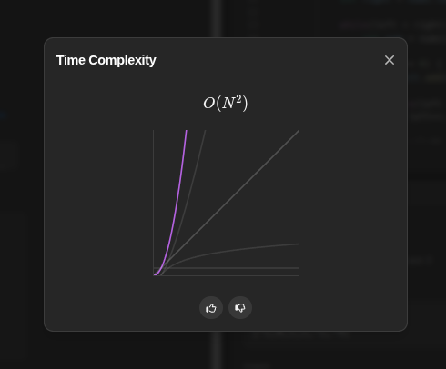

# 3Sum - Explicação e Solução em Java

## 🧩 Problema

Dado um array de inteiros `nums`, retorne **todas as trincas únicas** `[nums[i], nums[j], nums[k]]` tais que:
- i != j, i != k, j != k
- nums[i] + nums[j] + nums[k] == 0

As trincas devem ser únicas (sem repetições) e podem ser retornadas em qualquer ordem.

---

### 🔢 Exemplo:
**Input:**
```java
[-1, 0, 1, 2, -1, -4]
```
**Output:**
```java
[[-1, -1, 2], [-1, 0, 1]]
```

---

### Estratégia da Solução
A ideia principal é:
1. Ordenar o array: facilita o uso de dois ponteiros e o tratamento de duplicatas.
2. Fixar um número por vez e usar dois ponteiros (left e right) para encontrar os outros dois números que somem com ele e dêem zero.
3. Pular duplicatas para garantir que a saída não contenha trincas repetidas.

---

### Código Java 
```java
    public static List<List<Integer>> threeSum(int[] nums) {
        List<List<Integer>> result = new ArrayList<>();
        Arrays.sort(nums);

        for(int i = 0; i < nums.length - 2; i++) {
            if(i > 0 && nums[i] == nums[i - 1]) {
                continue;
            }

            int left = i + 1;
            int right = nums.length - 1;

            while(left < right) {
                int sum = nums[i] + nums[left] + nums[right];
                if(sum == 0) {
                    result.add(Arrays.asList(nums[i], nums[left], nums[right]));

                    while(left < right && nums[left] == nums[left + 1]){
                        left++;
                    }

                    while(left < right && nums[right] == nums[right - 1]){
                        right--;
                    }

                    left++;
                    right--;
                } else if(sum < 0) {
                    left++;
                } else {
                    right--;
                }
            }
        }
        return result;
    }
```
---
### Complexidade

